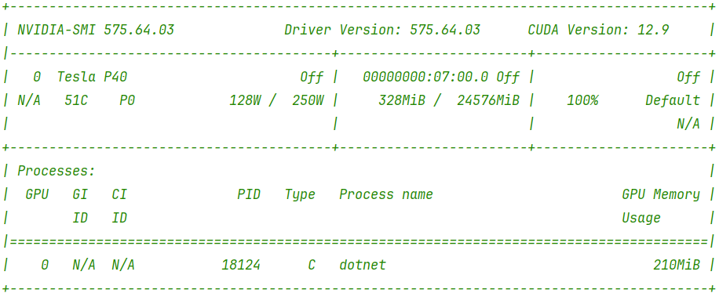

# MegaLCS

**An OpenCL-compatible(GPU) LCS(Longest Common Subsequence) algorithm supporting arrays with up to MILLION elements on a single GPU, ULTRA-FAST performance, and controllable time and memory usage.**

Keywords: [Longest Common Subsequence | LCS] [CUDA/OpenCL/Parallel]

---

For example, based on execution results from a Tesla P40 environment, comparing two integer arrays of length 1 million takes approximately **only 9.5 seconds**.

```
| Runtime       | MAX     | STEP | Mean         | Allocated   |
|-------------- |-------- |----- |-------------:|------------:|
| .NET 8.0      | 65536   | 256  |     138.3 ms |   579.05 KB |
| NativeAOT 8.0 | 65536   | 256  |     137.8 ms |   578.98 KB |
| .NET 8.0      | 1048576 | 256  |   9,532.7 ms |  8739.59 KB |
| NativeAOT 8.0 | 1048576 | 256  |   9,533.7 ms |  8739.51 KB |
| .NET 8.0      | 2097152 | 256  |  36,642.7 ms | 17443.59 KB |
| NativeAOT 8.0 | 2097152 | 256  |  36,642.4 ms | 17443.51 KB |
| NativeAOT 8.0 | 4194304 | 256  | 142,976.1 ms | 34851.51 KB |
```



## Why?

Although the Longest Common Subsequence problem has been extensively studied, most classic algorithms have a time complexity of O(n²). While various optimized variants exist, such as Myers', they often come with assumptions or constraints that do not hold in real-world applications involving extremely large arrays. In such cases, only the basic LCS algorithm can be applied. However, computing LCS for arrays of length 1 million on CPU is practically infeasible — GPU acceleration becomes essential.

There are many research efforts in this area, but existing implementations tend to be complex, and more importantly, most related papers lack publicly available source code :(. 

My goal was to solve this real-world problem with a simple and practical implementation. After repeated derivation, I discovered (perhaps reinvented) and implemented a concise, and fully parallel solution. The key insight lies in computing `LeftTopWeight` without any data dependencies:

**int leftTopWeight = Math.Min(leftWeight, topWeight);**

A prototype implementation can be found in `CpuLCS_NoDependency()`. For broader compatibility (e.g., if you have a powerful CPU and OpenCL support), the actual implementation uses OpenCL, with the kernel function named `KernelLCS_NoDependency`. Converting it to CUDA would also be straightforward.

## Getting Started

```bash
git clone https://github.com/orunco/MegaLCS.git
cd csharp\MegaLCSTest
dotnet run -c Release
```

Alternatively, you can import it into your own project and directly use the function interface:

```csharp
Mega.MegaLCS(int[] baseVals, int[] latestVals)
```

That’s all.

## Requirements

The project currently uses C# as the primary development language for ease of development and debugging.

- .NET 8+
- Silk.NET.OpenCL 2.22.0
- Maybe One Powerful GPU device

## TODO

- Consider a C++ implementation in the future for better portability.
- Currently, only the length of the LCS is computed. Backtracking to retrieve one or more actual common subsequences is not yet implemented. Given that weights are already calculated, implementing backtracking should be feasible and may be added in the future.

## License

Copyright (C) 2025 Pete Zhang, rivxer@gmail.com
Licensed under the Apache License, Version 2.0 (the "License");
